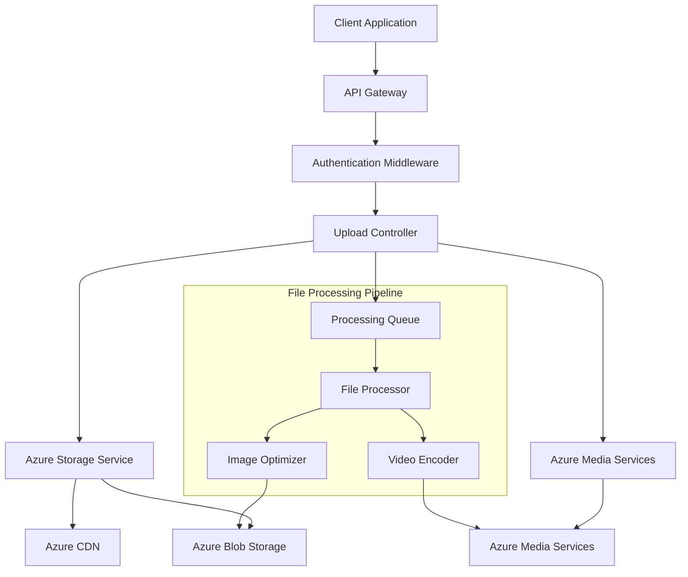

# Design Document

## Overview

The Azure Storage Integration feature provides a comprehensive cloud storage solution for the e-learning platform, leveraging Azure Blob Storage for file management and Azure Media Services for video processing. The design implements a multi-layered architecture with security, performance optimization, and scalability as core principles.

The system supports multiple file types including videos, images, documents, and assignments with automatic organization, processing, and delivery optimization. It integrates seamlessly with the existing authentication system and provides real-time upload progress, resumable uploads, and intelligent caching strategies.

## Architecture

### High-Level Architecture



### Service Layer Architecture

The design follows a service-oriented architecture with clear separation of concerns:

1. **Controller Layer**: Handles HTTP requests, validation, and response formatting
2. **Service Layer**: Contains business logic for file operations and processing
3. **Storage Layer**: Manages direct interactions with Azure services
4. **Middleware Layer**: Provides authentication, authorization, and request processing
5. **Queue Layer**: Handles asynchronous processing tasks

## Components and Interfaces

### Core Components

#### 1. File Upload Controller
```javascript
class FileUploadController {
  async uploadSingle(req, res)     // Single file upload
  async uploadMultiple(req, res)   // Multiple file upload
  async uploadChunked(req, res)    // Chunked/resumable upload
  async getUploadStatus(req, res)  // Upload progress tracking
}
```

#### 2. Azure Storage Service (Enhanced)
```javascript
class AzureStorageService {
  // Core file operations
  async uploadFile(file, options)
  async deleteFile(blobName)
  async getFileInfo(blobName)
  async generateSasUrl(blobName, options)
  
  // Advanced operations
  async uploadWithProgress(file, progressCallback)
  async resumableUpload(file, uploadId, chunk)
  async optimizeAndUpload(file, optimizationOptions)
  async createFileVersion(blobName, newVersion)
  
  // Batch operations
  async uploadBatch(files, options)
  async deleteBatch(blobNames)
  async copyBatch(sourceDestPairs)
}
```

#### 3. File Processing Service
```javascript
class FileProcessingService {
  async processImage(file, options)
  async processVideo(file, options)
  async processDocument(file, options)
  async generateThumbnails(file)
  async extractMetadata(file)
  async scanForMalware(file)
}
```

#### 4. Storage Quota Manager
```javascript
class StorageQuotaManager {
  async checkUserQuota(userId)
  async updateUsage(userId, sizeChange)
  async enforceQuotaLimits(userId, requestedSize)
  async generateUsageReport(userId)
  async cleanupExpiredFiles()
}
```

### Interface Definitions

#### File Upload Request Interface
```typescript
interface FileUploadRequest {
  file: File | File[]
  folder?: string
  isPublic?: boolean
  generateThumbnail?: boolean
  optimizeImage?: boolean
  metadata?: Record<string, any>
  progressCallback?: (progress: number) => void
}
```

#### File Response Interface
```typescript
interface FileUploadResponse {
  success: boolean
  files: {
    id: string
    url: string
    secureUrl: string
    fileName: string
    originalName: string
    size: number
    contentType: string
    folder: string
    thumbnailUrl?: string
    metadata: Record<string, any>
  }[]
  errors?: string[]
}
```

## Data Models

### File Entity Model
```javascript
const FileSchema = new mongoose.Schema({
  _id: { type: String, default: () => uuidv4() },
  fileName: { type: String, required: true },
  originalName: { type: String, required: true },
  blobName: { type: String, required: true, unique: true },
  url: { type: String, required: true },
  secureUrl: String,
  size: { type: Number, required: true },
  contentType: { type: String, required: true },
  folder: { type: String, default: 'general' },
  
  // Ownership and access
  uploadedBy: { type: mongoose.Schema.Types.ObjectId, ref: 'User', required: true },
  courseId: { type: mongoose.Schema.Types.ObjectId, ref: 'Course' },
  isPublic: { type: Boolean, default: false },
  accessLevel: { 
    type: String, 
    enum: ['public', 'course', 'private'], 
    default: 'private' 
  },
  
  // Processing status
  processingStatus: {
    type: String,
    enum: ['pending', 'processing', 'completed', 'failed'],
    default: 'pending'
  },
  thumbnailUrl: String,
  streamingUrls: {
    hls: String,
    dash: String,
    smoothStreaming: String
  },
  
  // Metadata
  metadata: { type: Map, of: String },
  tags: [String],
  description: String,
  
  // Versioning
  version: { type: Number, default: 1 },
  parentFileId: { type: String, ref: 'File' },
  
  // Lifecycle
  expiresAt: Date,
  lastAccessedAt: { type: Date, default: Date.now },
  downloadCount: { type: Number, default: 0 },
  
  // Timestamps
  createdAt: { type: Date, default: Date.now },
  updatedAt: { type: Date, default: Date.now }
})
```

### Storage Usage Model
```javascript
const StorageUsageSchema = new mongoose.Schema({
  userId: { type: mongoose.Schema.Types.ObjectId, ref: 'User', required: true },
  totalSize: { type: Number, default: 0 },
  fileCount: { type: Number, default: 0 },
  quotaLimit: { type: Number, default: 1073741824 }, // 1GB default
  
  // Usage by type
  usageByType: {
    images: { size: Number, count: Number },
    videos: { size: Number, count: Number },
    documents: { size: Number, count: Number },
    other: { size: Number, count: Number }
  },
  
  // Alerts
  alertThresholds: {
    warning: { type: Number, default: 0.8 }, // 80%
    critical: { type: Number, default: 0.95 } // 95%
  },
  lastAlertSent: Date,
  
  updatedAt: { type: Date, default: Date.now }
})
```

## Error Handling

### Error Classification System

#### 1. Upload Errors
- **ValidationError**: Invalid file type, size, or format
- **QuotaExceededError**: User storage quota exceeded
- **NetworkError**: Connection issues during upload
- **AuthorizationError**: Insufficient permissions

#### 2. Processing Errors
- **ProcessingTimeoutError**: File processing took too long
- **UnsupportedFormatError**: File format not supported for processing
- **CorruptedFileError**: File is corrupted or unreadable
- **MalwareDetectedError**: Security scan detected threats

#### 3. Storage Errors
- **StorageUnavailableError**: Azure Storage service unavailable
- **InsufficientStorageError**: Azure Storage account full
- **AccessDeniedError**: Invalid credentials or permissions
- **FileNotFoundError**: Requested file doesn't exist

### Error Response Format
```javascript
{
  success: false,
  error: {
    code: 'QUOTA_EXCEEDED',
    message: 'Storage quota exceeded. Please delete some files or upgrade your plan.',
    details: {
      currentUsage: 1073741824,
      quotaLimit: 1073741824,
      availableSpace: 0
    },
    retryable: false,
    timestamp: '2024-01-15T10:30:00Z'
  }
}
```

### Retry Strategy
```javascript
const retryConfig = {
  maxRetries: 3,
  backoffStrategy: 'exponential',
  retryableErrors: ['NetworkError', 'StorageUnavailableError'],
  nonRetryableErrors: ['ValidationError', 'QuotaExceededError', 'MalwareDetectedError']
}
```

## Testing Strategy

### Unit Testing Approach

#### 1. Service Layer Tests
- **Azure Storage Service**: Mock Azure SDK calls, test file operations
- **File Processing Service**: Test image optimization, video processing
- **Quota Manager**: Test quota calculations and enforcement
- **Error Handling**: Test all error scenarios and recovery

#### 2. Integration Tests
- **End-to-End Upload Flow**: Test complete upload pipeline
- **Authentication Integration**: Test with real auth tokens
- **Database Integration**: Test file metadata persistence
- **Azure Services Integration**: Test with Azure Storage emulator

#### 3. Performance Tests
- **Large File Uploads**: Test files up to maximum size limits
- **Concurrent Uploads**: Test multiple simultaneous uploads
- **Bandwidth Throttling**: Test under various network conditions
- **Memory Usage**: Monitor memory consumption during processing

### Test Data Management
```javascript
const testDataSets = {
  images: {
    small: 'test-image-100kb.jpg',
    medium: 'test-image-1mb.png',
    large: 'test-image-10mb.tiff'
  },
  videos: {
    short: 'test-video-30s.mp4',
    medium: 'test-video-5min.mov',
    large: 'test-video-1hour.avi'
  },
  documents: {
    pdf: 'test-document.pdf',
    word: 'test-document.docx',
    excel: 'test-spreadsheet.xlsx'
  }
}
```

### Security Testing
- **File Type Validation**: Test malicious file uploads
- **Size Limit Enforcement**: Test oversized file rejection
- **Access Control**: Test unauthorized access attempts
- **SAS Token Security**: Test token expiration and permissions
- **Malware Detection**: Test with known malware samples (safely)

### Monitoring and Observability

#### Key Metrics to Track
- Upload success/failure rates
- Average upload time by file size
- Storage usage trends
- Processing queue length
- Error rates by category
- User quota utilization

#### Logging Strategy
```javascript
const logLevels = {
  ERROR: 'Upload failures, processing errors, security issues',
  WARN: 'Quota warnings, slow uploads, retry attempts',
  INFO: 'Successful uploads, processing completions',
  DEBUG: 'Detailed operation traces, performance metrics'
}
```

#### Health Checks
- Azure Storage connectivity
- Azure Media Services availability
- Processing queue health
- Database connectivity
- CDN performance